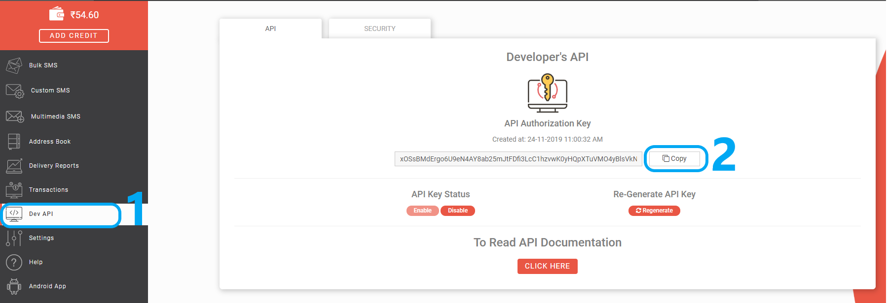

# Automated Birthday Wisher
Python project to send automatic birthday wish to saved contact on his/her birthday. Program automatically checks for birthday at startup and sends birthday wishes to person's email, via sms, Facebook and Whatsapp personal and groups. 

# Installation
Clone or download repository.

### Requirements
1) Python 3.x must be installed. Refere [this](https://realpython.com/installing-python/) link for python installation.
 Download Python 3.x from (https://www.python.org/downloads/) Select appropriate operating system. 
 <b>Make sure to check <i>add to PATH</i> while installing python</b>
2) Chrome Browser should be installed in system. (Download Chrome from [here](https://www.google.com/chrome/) for windows and to install on Ubuntu follow [this](https://itsfoss.com/install-chrome-ubuntu/) guide)
3) Fast2Sms account to send sms.
4) Your Gmail account should allow less secure apps which important to send mail. If your account has two factor authentication then it must be disabled for program to be work.([Click here](https://devanswers.co/allow-less-secure-apps-access-gmail-account/) for guidance)

<i>At first 3-4 times facebook will decline login due to newly used IP but after that it will allow user to send messages. So stay tuned.
</i>

#### Setup Sms Accout 
To setup account for sms, we are using Fast2Sms service
   1. Visit [fast2sms](https://www.fast2sms.com/)
   2. Complete Registration and login with your credentials.
   3. You will be credited 50 rupees as signup balance. Verify your email id to get 5 more.
   4. Click on Dev API and copy **API key** from there. Paste it while setting up local account.
   
   
   *(fast2sms is a paid service. Each message you send will cost 0.40 rupees and they will be deducted from your fast2sms account. Hence if you have 0 account balance then you no longer send sms.)*

  

If all the above requirements are fulfilled then follow these steps:

Step 1: Run Installation file for required platform (Windows/Linux)

Step 2: Save the login credentials (Facebook, Gmail, Sms)

Step3: Add Person's details to whom have to send Birthday wish

Read following instruction for specific platform
  

## Windows Setup

### Setup
Navigate to the project folder you cloned or downloaded and 

    Run Install.bat
    
To run a .bat file just double click on file.

At the end, a registration window will appear to save login details. Fill username and password for facebook and Gmail, API key for sms and click on save. (You can change the credentials by again running <i>'Registration.bat'</i> file and enter valid details. It will overwrite existing details.)

#### Add Contact/Person Details
    1) Run Add Contact.bat
    2) Enter details of person and group names to send wishes to
    3) Choose the file format to save details. (you can change or delete contact by opening file in Data/credentials folder in installation directory)

This will complete the setup and program will automatically send birthday wish to contact on his/her birthday. After restarting system program will check for birthday and program will need internet connection while sending wish so make sure you are connected to internet.

*If you wish to run program immediately without restarting system then run *AutomatedBirthday.bat* file.

*If you moved program folder after installation in different directory then you have to run *Install.bat* again.
#### Uninstall

    Run Uninstall.bat
  

## Linux Installation

### Setup
Navigate to the Navigate to the project folder you cloned or downloaded and Open the terminal there (location can be /home/user/programs/Automated_BDay_Wish/Linux/)

Type the following commands in terminal
    
    $ chmod +x install.sh
    $ ./install.sh

At the end, a registration window will appear to save login details. Fill username and password for facebook and Gmail, API key for sms and click on save.

#### Changing login details
Navigate to project folder and open terminal there and enter following command
    
    $ ./Registration.sh

Now enter details to be change and save.

#### Add Contact/Person Details
Navigate to program folder and open terminal there

    1) Type ./Add_Contact.sh and hit enter
    2) Enter details of person and group names to send wishes to
    3) Choose the file format to save details. (you can change or delete contact by opening file in Data/credentials folder in program directory)

This will complete the setup and program will automatically send birthday wish to contact on his/her birthday. After restarting system program will check for birthday and program will need internet connection while sending wish so make sure you are connected to internet.

If you wish to run program immediately without restarting system then:
    
    $ systemctl --user start AutomatedBirthday.service
 
If you moved program folder after installation in different directory then you have to run <i>install.sh</i> again.
 

#### Uninstall
    
    $ ./uninstall.sh
    

  
<b><i>** Unfortunately Whatsapp feature is not working in Linux</i></b>
